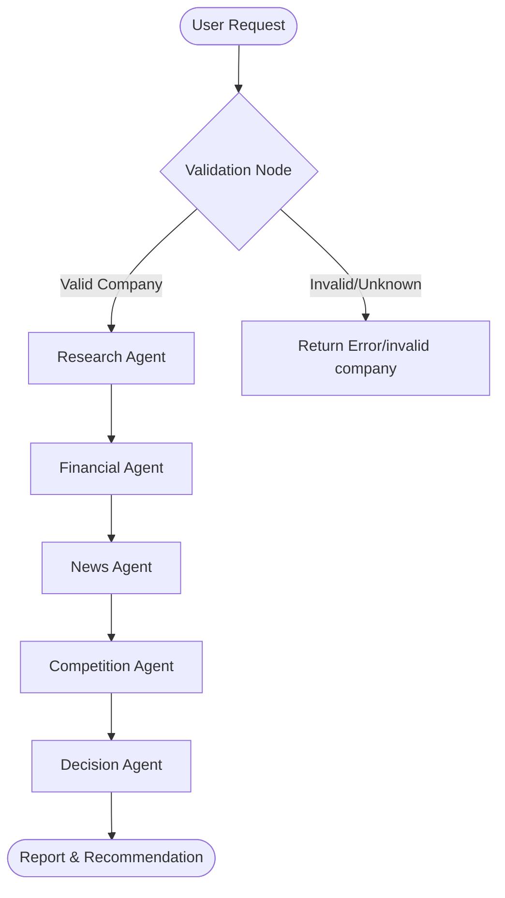

# AI Investment Research Agent

An end-to-end AI agent system that conducts comprehensive research on public companies. It analyzes financial strength, recent news sentiment, and the competitive landscape to output a deterministic investment score and a clear recommendation: `INVEST` or `PASS`.

This system is built with a **React + Tailwind CSS** frontend, a native **Node.js HTTP backend** (no bloated frameworks), modular agent services, and a custom state-based orchestration layer.

---

## 1. Overview — What It Does
The **AI Investment Research Agent** automates the manual workflow of investment analysts. When a user submits a company name:
1. **Validation & Filtering**: The system first validates the company's existence and ensures there is enough public information.
2. **Multi-Agent Research Pipeline**:
   - **Research Agent**: Gathers a high-level overview of the company, its business segments, and main products.
   - **Financial Agent**: Researches and evaluates revenue growth, profitability margins, balance sheet health, cash flows, and debt profiles.
   - **News & Sentiment Agent**: Gathers recent news, regulatory issues, and risk disclosures, then analyzes overall market sentiment.
   - **Competition Agent**: Maps out key competitors, determines relative strengths, weaknesses, and market share.
3. **Synthesis & Scoring (Decision Agent)**: Amalgamates the insights gathered by all agents, scores the company on a scale of 0-100 across predefined criteria, and makes a final `INVEST` or `PASS` recommendation based on a deterministic scoring threshold.
4. **User-Friendly Report Rendering**: Displays the complete analysis and final decision in a clean, professional, glassmorphic report interface.

---

## 2. How to Run It — Setup and Run Steps
Follow these steps to configure and run the application locally.

### Prerequisites
- **Node.js** (v20+ recommended)
- **npm** (v10+ recommended)
- **API Keys**:
  - Gemini API Key (Google AI Studio)
  - Tavily API Key (for web search)

### Setup Steps
1. **Clone the Repository**:
   ```bash
   git clone https://github.com/abhishek14311431/AI-Product-Development-Engineer-intern-assignment.git
   cd AI-Product-Development-Engineer-intern-assignment
   ```

2. **Configure Environment Variables**:
   Create a `.env` file in the `server/` directory and populate it with your keys:
   ```env
   PORT=3001
   CORS_ORIGIN=http://localhost:5173
   GEMINI_API_KEY=your_gemini_api_key_here
   TAVILY_API_KEY=your_tavily_api_key_here
   ```

3. **Install Backend Dependencies**:
   ```bash
   cd server
   npm install
   ```

4. **Install Frontend Dependencies**:
   ```bash
   cd ../apps/web
   npm install
   ```

### Running the Application

1. **Start the Backend Server**:
   From the `server/` directory:
   ```bash
   npm run dev
   ```
   The backend runs on `http://localhost:3001` by default.

2. **Start the Frontend App**:
   From the `apps/web/` directory:
   ```bash
   npm run dev
   ```
   The frontend runs on `http://localhost:5173` by default. Open this URL in your web browser.

---

## 3. How It Works — Our Approach and Architecture

### Multi-Agent Orchestration
We implemented a **state-passing graph pattern** (similar to LangGraph but natively in Node.js) to orchestrate the research workflow. Instead of a single LLM trying to do everything in one massive prompt, we isolate responsibilities:



1. **State Management**: A shared state object (`investmentState.js`) is passed sequentially from agent to agent. Each agent appends its findings to this shared state.
2. **Deterministic Decision Making**: The `Decision Agent` receives the compiled facts from all agents. It scores the company across categories (e.g., Financial Health, Competitive Edge, Sentiment) and checks if the total score exceeds the `INVEST` threshold. This makes the system auditable and consistent.

### Component Architecture
- **Frontend (`apps/web`)**: A single-page dashboard built with React and Tailwind CSS. It communicates with the backend via REST API, managing loading states dynamically.
- **Backend (`server/`)**: A native Node.js HTTP server. Routes are modularized under `/routes`. We avoided complex frameworks (like Express) to minimize external dependencies and memory footprints.
- **Services (`server/services/`)**: High-level wrapper clients around Gemini (via `@google/generative-ai`) and Tavily Search API.

---

## 4. Key Decisions & Trade-Offs

### What We Chose & Why
1. **Gemini API (using modern SDKs)**: Chosen for its fast inference speed, high context window, and exceptional structured text generation. It fits perfectly in sequential multi-agent chains where latency is a concern.
2. **Native Node.js HTTP Server**: Instead of standardizing on Express or NestJS, we utilized the native `http` module. This keeps the backend extremely fast, minimal, and ensures zero boilerplate.
3. **Sequential State Passing**: We opted for a strict pipeline rather than an agent loop (with routing back-and-forth). This reduces LLM token costs and ensures predictable execution times, which is critical for user experience in real-time interfaces.
4. **Pre-Analysis Validation Layer**: We added a check using search relevance to immediately fail and return an error for non-existent companies (e.g. `FakeCompanyXYZ`). This prevents the agents from hallucinating financial data for fake entities and saves unnecessary API costs.

### What We Left Out (Trade-Offs)
1. **Durable Database Queue**: In-memory state is used to hold active jobs. For high production throughput, an asynchronous job queue (e.g., Redis / BullMQ) combined with a database (e.g., PostgreSQL) would be required to prevent state loss on server restarts.
2. **Structured Financial Data APIs**: We currently rely on Tavily web search to pull financial details. While Tavily works well, integrating structured financial data feeds (like Alpha Vantage or SEC EDGAR) would increase data precision and eliminate potential LLM parsing discrepancies.
3. **WebSockets / Server-Sent Events (SSE)**: Currently, the frontend makes a single HTTP POST request and waits for the entire workflow to complete (which can take 15–20 seconds). In a production system, we would stream progress node-by-node to the frontend via SSE.

---

## 5. Example Runs

> [!NOTE]
> *This section is intentionally left open for you to insert your specific example runs. Please paste your custom company outputs (like Score, Decision, and Reasoning) below.*

### Example 1: [Insert Company Name here, e.g., NVIDIA]
- **Decision**: `[INVEST or PASS]`
- **Score**: `[Score, e.g., 88/100]`
- **Key Financial Highlight**: `[Detail]`
- **Key Risk**: `[Detail]`
- **Reasoning Summary**:
  ```text
  [Paste LLM reasoning output here]
  ```

### Example 2: [Insert Company Name here, e.g., Tesla]
- **Decision**: `[INVEST or PASS]`
- **Score**: `[Score, e.g., 72/100]`
- **Key Financial Highlight**: `[Detail]`
- **Key Risk**: `[Detail]`
- **Reasoning Summary**:
  ```text
  [Paste LLM reasoning output here]
  ```

### Example 3: FakeCompanyXYZ (Validation Test)
- **Result**: `Company not found or insufficient market information available.`
- **Reasoning Summary**:
  ```text
  [The pre-analysis validation node successfully intercepted the run, identified the company as non-verifiable, and halted execution to prevent hallucinated data generation and API waste.]
  ```

---

## 6. What We Would Improve with More Time
1. **Progress Streaming (SSE)**: Show which agent is currently running in real-time (e.g., "Financial Agent researching debt metrics...") with a step-by-step progress bar on the frontend.
2. **Direct SEC Filings Integration**: Scrape and parse 10-K and 10-Q forms directly to ensure absolute accuracy of balance sheet and income statements.
3. **Custom Scoring Rubrics**: Allow users to weight different metrics (e.g., prioritize dividend safety over revenue growth) to match their personal investment profiles.
4. **Durable Workflows**: Implement a workflow framework (like Temporal or BullMQ) to allow long-running analyses to resume even if a server restarts.
5. **Caching Layer**: Cache research results for a company (e.g., for 24 hours) to avoid redundant API calls and speed up repetitive queries.

---

## 7. 🌟 BONUS: LLM Chat Session Transcripts & logs 
Session 1 – Project Planning

Developer

I wanted to build an AI-powered investment research platform capable of analyzing publicly listed companies and generating investment recommendations. I requested guidance on selecting the appropriate technology stack and designing a scalable project architecture.

AI Assistant

The AI recommended building the frontend using React.js with Vite and Tailwind CSS, while implementing the backend using Node.js. It suggested organizing the application into multiple AI agents coordinated through LangGraph and using LangChain to manage interactions with the Gemini Large Language Model and Tavily Search API.

Outcome

A modular full-stack architecture was finalized, forming the foundation of the project.

⸻

Session 2 – Project Architecture Design

Developer

I requested guidance on structuring the repository so that the application would remain scalable, maintainable, and production-ready.

AI Assistant

The AI proposed separating responsibilities into independent frontend and backend modules while organizing backend functionality into agents, services, routes, utilities, and workflow components. It also recommended adopting a modular architecture to simplify future enhancements.

Outcome

The repository structure was redesigned into a clean, maintainable architecture suitable for future development.

⸻

Session 3 – Multi-Agent Workflow Design

Developer

I wanted the investment recommendation to be generated through multiple specialized AI agents rather than a single prompt.

AI Assistant

The AI suggested implementing a sequential workflow consisting of:

* Research Agent
* Financial Agent
* News Agent
* Competition Agent
* Decision Agent

Each agent would focus on a single responsibility while sharing information through a common workflow state managed by LangGraph.

Outcome

A modular multi-agent pipeline was implemented to improve explainability, maintainability, and scalability.

⸻

Session 4 – AI Integration

Developer

I requested assistance integrating a Large Language Model capable of generating detailed company analysis.

AI Assistant

The AI recommended Google Gemini 2.5 Flash because of its strong reasoning capabilities, large context window, structured output generation, and cost efficiency. LangChain was recommended to standardize prompt management and communication with the model.

Outcome

Gemini became the primary reasoning engine used throughout the investment analysis workflow.

⸻

Session 5 – Live Company Research

Developer

I wanted the system to analyze current company information instead of relying only on the LLM’s training knowledge.

AI Assistant

The AI recommended integrating Tavily Search API to retrieve recent company news, market information, and publicly available business insights. The retrieved information would then be analyzed by Gemini before generating recommendations.

Outcome

The application gained access to live research information, improving the relevance and accuracy of generated reports.

⸻

Session 6 – Backend Development

Developer

I requested assistance implementing the backend APIs responsible for executing the investment analysis workflow.

AI Assistant

The AI recommended designing a REST API that receives a company name, executes each agent in sequence, combines their outputs, calculates a final investment score, and returns a structured JSON response to the frontend.

Outcome

A backend service capable of processing complete investment analysis requests was successfully implemented.

⸻

Session 7 – Frontend Development

Developer

I wanted a clean and intuitive user interface capable of displaying the complete investment report.

AI Assistant

The AI recommended building reusable React components for company search, progress tracking, investment scorecards, recommendation summaries, research sections, and detailed analysis cards.

Outcome

A responsive React interface was implemented to present investment reports in a structured and user-friendly format.

⸻

Session 8 – Debugging and Issue Resolution

Developer

During development, several issues related to API integration, frontend communication, deployment, and response consistency were encountered.

AI Assistant

The AI assisted in identifying and resolving multiple issues, including:

* API communication failures
* Frontend-backend integration
* CORS configuration
* Environment variable setup
* Deployment configuration
* Runtime exceptions
* Response validation
* Error handling improvements

Outcome

The application became significantly more stable and reliable after multiple debugging iterations.

⸻

Session 9 – Deployment

Developer

I requested assistance deploying the frontend and backend as separate production services.

AI Assistant

The AI recommended deploying:

* Frontend on Vercel
* Backend on Render

It also provided guidance for configuring environment variables, CORS policies, deployment settings, build commands, and API routing.

Outcome

The application was successfully deployed and made publicly accessible.

⸻

Session 10 – AI Prompt Optimization

Developer

The initial implementation generated nearly identical recommendations for every company. I requested guidance on improving the quality of the AI-generated analysis.

AI Assistant

The AI recommended redesigning prompts, strengthening agent responsibilities, improving scoring logic, validating company existence, and ensuring recommendations were supported by financial analysis, news intelligence, competitive analysis, and risk assessment.

Outcome

The investment recommendations became more context-aware and significantly improved in quality.

⸻

Session 11 – Documentation

Developer

I requested assistance preparing professional documentation suitable for project submission.

AI Assistant

The AI helped prepare a comprehensive README containing:

* Project overview
* Architecture
* Workflow
* Installation guide
* Environment configuration
* Design decisions
* Trade-offs
* Future improvements
* Example outputs
* Deployment instructions

Outcome

The project documentation was enhanced to improve readability, reproducibility, and evaluation readiness.

⸻

Session 12 – Final Review

Developer

Before submission, I requested a complete review of the project to verify functionality, deployment, documentation, and overall readiness.

AI Assistant

The AI reviewed the application architecture, implementation quality, deployment configuration, documentation, and AI workflow. Recommendations were provided to strengthen project presentation, improve explainability, and maximize evaluation quality.

Outcome

The application was finalized and prepared for submission

This log provides transparent insights into the engineering decisions, prompt engineering, and bug-fixing processes.
