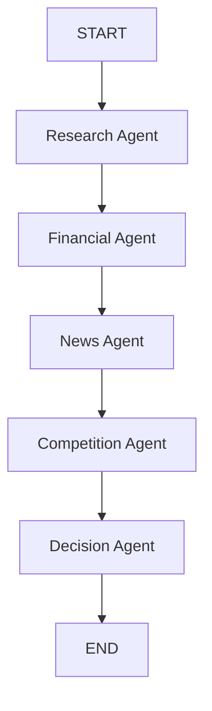

# AI Investment Research Agent

An end-to-end AI system that researches a public company, analyzes financial strength, news flow, and competitive position, then returns a clear investment recommendation: `INVEST` or `PASS`.

This repository is structured like a production-ready product submission for an AI startup: a React + Tailwind frontend, a native Node.js backend, reusable agent services, and a LangGraph-style orchestration layer.

## 1. Overview

The product accepts a company name, runs a multi-step research workflow, and produces an investment decision with supporting evidence.

The workflow is designed to be explainable, modular, and easy to extend. Each analysis stage is isolated into its own agent so the system can evolve from a prototype into a production research platform without rewriting the entire stack.

## 2. Features

- Company search and research intake
- Automated financial analysis
- News and sentiment analysis
- Competitive landscape analysis
- Deterministic investment scoring
- Final `INVEST` or `PASS` decision
- Clean, report-style frontend output
- Shared-state workflow orchestration
- Reusable Gemini and Tavily services
- Native HTTP backend with consistent JSON responses

## 3. Architecture

The system is organized into three layers:

- Frontend: React + Vite + Tailwind UI for company input and report rendering
- Backend: Native Node.js HTTP server exposing `/analyze` and supporting routes
- Agent layer: Modular agents for research, financials, news, competition, and decision making

High-level request flow:

1. User enters a company name in the frontend
2. Frontend calls `POST /analyze`
3. Backend sends the request into the investment workflow
4. Research, financial, news, and competition agents gather and synthesize evidence
5. Decision agent scores the company and returns `INVEST` or `PASS`
6. Frontend renders the full report

## 4. Tech Stack

- Frontend: React, Vite, TailwindCSS
- Backend: Node.js, native `http` server, ES Modules
- Orchestration: LangGraph-style workflow design
- LLM: Gemini 2.5 Flash
- Search: Tavily Search API
- State: Shared in-memory workflow state for the current implementation

## 5. Setup Instructions

### Prerequisites

- Node.js 20+
- npm 10+
- Gemini API key
- Tavily API key

### 1. Install backend dependencies

From the project root:

```bash
cd server
npm install
```

### 2. Install frontend dependencies

```bash
cd ../apps/web
npm install
```

### 3. Start the backend

```bash
cd ../../server
npm run dev
```

The backend runs on `http://localhost:3001` by default.

### 4. Start the frontend

```bash
cd ../apps/web
npm run dev
```

The frontend runs on `http://localhost:5173` by default.

## 6. Environment Variables

Create a `.env` file in `server/` and define:

```env
PORT=3001
CORS_ORIGIN=http://localhost:5173
GEMINI_API_KEY=your_gemini_key
TAVILY_API_KEY=your_tavily_key
```

Optional Gemini compatibility variable:

```env
GOOGLE_GEMINI_API_KEY=your_gemini_key
```

## 7. How It Works

The backend exposes `POST /analyze` and accepts a payload like:

```json
{
	"company": "Tesla"
}
```

That request runs the workflow in sequence:

1. Research agent gathers a company overview
2. Financial agent summarizes revenue, profitability, cash flow, debt, and stability
3. News agent reviews recent developments, positive news, negative news, legal issues, and risks
4. Competition agent maps competitors, strengths, weaknesses, and market position
5. Decision agent calculates a score out of 100 and produces `INVEST` or `PASS`

The frontend submits the company name, shows loading feedback, and renders the final report once the backend returns.

## 8. Agent Workflow



Shared state is carried across the workflow so each agent enriches the same investment record. The current implementation keeps the flow modular and readable, with logging and error wrapping at the graph level.

## 9. Example Outputs

### Example request

```json
{
	"company": "Tesla"
}
```

### Example response

```json
{
	"company": "Tesla",
	"research": "Tesla is an electric vehicle and clean energy company...",
	"financialAnalysis": "Revenue growth remains strong, but profitability is under pressure...",
	"newsAnalysis": "Recent news highlights product launches, delivery trends, and regulatory attention...",
	"competitionAnalysis": "Tesla competes with legacy automakers and EV-native peers...",
	"score": 74,
	"decision": "INVEST",
	"reasoning": "Growth and competitive positioning outweigh the current risk profile..."
}
```

## 10. Trade-offs

- The current workflow uses in-memory state instead of a durable queue or database.
- Tavily-based research is fast to ship, but structured market data sources would improve precision.
- Gemini adds strong synthesis quality, but the final score still depends on source quality and prompt discipline.
- The decision step is intentionally deterministic to keep the final recommendation auditable.
- The frontend prioritizes clarity and speed of understanding over dense analytics dashboards.

## 11. Future Improvements

- Persist workflow runs in a database
- Stream agent progress to the frontend
- Add market data and SEC filing integrations
- Introduce source ranking and citation scoring
- Add authentication and rate limiting
- Expand evaluation with labeled benchmark companies
- Support reruns with configurable risk profiles
- Add automated tests for workflow nodes and API contracts

## Repository Layout

```text
apps/
	web/        React + Vite frontend
server/       Native HTTP backend, agents, graph, services
```

## API Surface

- `POST /analyze` runs the full investment workflow
- `GET /api/health` checks service availability
- Research job endpoints are available under `/api/research`

## Notes

This repository is intentionally scaffolded to mirror how a serious AI product team would structure a research-driven decision system: small composable modules, explicit orchestration, and a user-facing experience that presents the model output as a clear decision artifact rather than raw text.